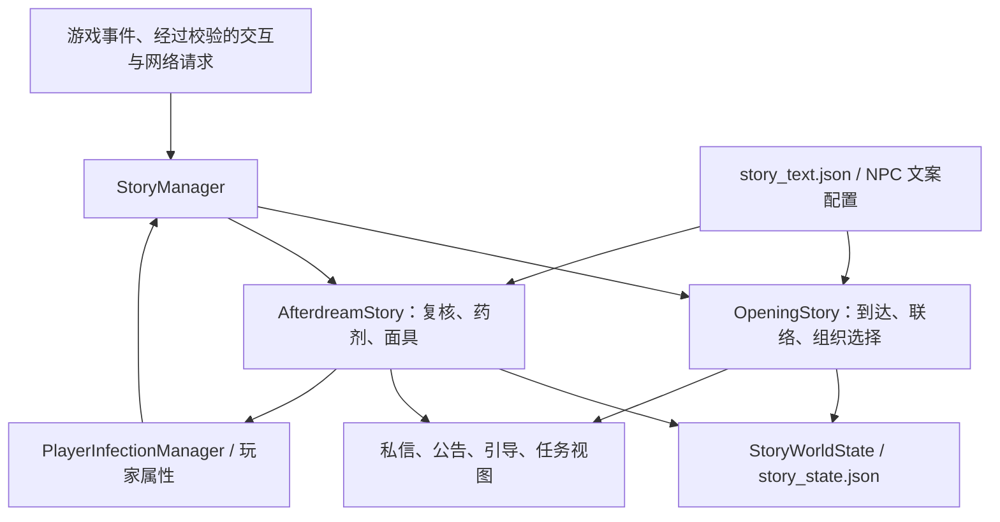

# 剧情系统审查与下一轮剧情建议

审查日期：2026-09-05。对象为 DreamingFishCore 1.21.1 当前工作区，包含尚未提交的重构与 2.2.1 改动；不是仅审查 Git HEAD，也不把 1.20.1 版本作为线上实现。设计依据为 `D:/Desktop/PROJECT-M.D.G.A` 中的世界背景、阶段、人物和当前实装剧情文档。

服主确认：线上与当前开发内容一致；活跃玩家十余人，已有三名二级感染者，两名玩家接近因死亡被封禁。目前没有重生锦鲤的获取渠道，没有额外重生点补充渠道，剧情只发过一次基因复苏试剂。两组玩家是否重合未知。

本次只做审查和建议，没有修改生产代码、玩家存档、设计稿或远程服务器。以下新场景、新规则和接口均为建议，尚未实装。

## 1. 结论

**保留当前“Java 编写流程、JSON 编写文案、StoryManager 统一协调”的方向，做针对性的整理，继续开发。没有必要再推翻重做一套剧情引擎。**

当前架构适合两条较短的个人流程，也适合继续由开发者、AI 协助编写明确的剧情事件。类型和条件可以在 Java 中直接检查，比继续维护字符串节点图更容易定位问题。代价是改流程需要发布模组；在当前创作方式下，这个代价可以接受。

但是，当前实现还不能直接视为成熟的多人叙事平台。单阶段单引导、通过引导推断任务类型、跨阶段完成状态、跨存档恢复和后续阶段接入仍存在明显问题。继续照着两个阶段复制，会把复杂度转移到 StoryManager 和阶段大文件中。

**目前最紧迫的是玩法闭环：感染恶化和死亡淘汰已经运行，稳定治疗与持续救援尚未落地。** 对十余人的服务器，这会先消耗掉参与剧情的人。下一次更新应先接住现有患者和濒临失去重生资格的玩家，再扩展管制与调查内容。

## 2. 当前实际实现

图中箭头表示调用或读写关系。剧情步骤集中在故事存档中，但玩家属性、组织身份、私信、公告和原版物品栏仍各自持久化；统一入口并不等于这些数据已经处于同一个持久化事务中。

| 范围 | 已有能力 | 实际边界 |
| --- | --- | --- |
| 梦的开始 | 读公告、进入阿拜多斯、见白芷、联系周岑、选择加入或独立、成员补给 | 基地建设主要靠玩家行为和服主阶段收束，没有自动建筑验收 |
| 余梦期 | 医疗公告、私信、进入接待点、江晚复核、一次发药、实际服药判定、面具发放 | 没有二级治疗流程，没有持续补药服务 |
| 世界事件 | 面具倒计时、感染恶化公告、丧尸挖掘开启 | 面具使用全服活动 tick；丧尸事件使用世界 gameTime |
| 基础设施 | 地点保护、NPC 交互、私信记录、个人引导、任务结果、历史日志、随记本片段基础 | 不等于已有完整调查、公共证据、投票与局部事件系统 |
| 后续阶段 | 世界旗标、任务结算 API 等基础 | 只注册两个阶段；管制期、疑光期、破晓期仍是设计方向 |

值得保留的实现包括：

- 阶段 ID 与显示名分开，世界阶段与个人组织选择分开。
- 当前剧情由服务端推进，客户端直接完成故事任务的旧入口已经被拒绝。
- 阶段脚本集中接收事件，NPC 新会话与界面刷新分开，避免同次接待直接领取两类奖励。
- 发药、服药、首次接待、领取面具已有不同事实字段；不能把“拿到药”算作治疗完成。
- 故事文件校验失败时禁止覆盖，单文件使用原子替换，并有登录时补建部分投影的逻辑。

这些不是需要抛弃的部分。当前问题主要出在这些边界尚未贯彻到每条分支与恢复路径。

## 3. 具体代码问题

以下“静态确认”指完整调用链能够推出该行为，未在实际 Minecraft 会话中操作复现；测试结果另列。

### F1 · P1：二级感染者进入无法执行的服药引导

**触发：** 二级感染者完成首次复核，再继续与江晚交互。

`RESULT_LEVEL_TWO` 与可治疗分支共用后续处理，进入 `AWAITING_TREATMENT`；该状态的对白要求先服用试剂。药剂本身明确拒绝二级感染。领取面具之后，如果治疗事实仍为 false，也会回到等待治疗状态，并重新创建去找江晚的引导。

结果是：NPC 先说明没有治疗方案，随后又要求患者服用无法使用的药；玩家完成面具领取后仍可能被引导回这个循环。线上三名二级感染者已经具备遇到它的条件。

**建议：** 增加明确的“复核完成、等待后续方案”处理，保留 `medicalTreatmentCompleted=false`，给予可完成的观察或咨询行动。将“完成复核”和“已经治愈”分别查询。将来新增稳定治疗后，再由真实的治疗事件更新对应事实。

证据：[AfterdreamStory.java:390](D:/Desktop/DreamingFishCore-1.21.1/src/main/java/com/hhy/dreamingfishcore/gameplay/afterdream_story_system/AfterdreamStory.java:390)、[后续引导重建:292](D:/Desktop/DreamingFishCore-1.21.1/src/main/java/com/hhy/dreamingfishcore/gameplay/afterdream_story_system/AfterdreamStory.java:292)、[服药对白:93](D:/Desktop/DreamingFishCore-1.21.1/src/main/resources/dreamingfishcore/defaults/story_text.json:93)、[药剂等级检查:135](D:/Desktop/DreamingFishCore-1.21.1/src/main/java/com/hhy/dreamingfishcore/item/items/Potion_RestoreUnInfected.java:135)。

### F2 · P2：重读旧私信会覆盖当前引导

**触发：** 已到达江晚、正在等面具，或已经完成医疗流程的玩家，再打开白芷会话。

消息系统会重放所有已读定义。`AfterdreamStory.onNpcMessageRead` 虽然只在早期状态推进步骤，却无条件创建“前往医疗接待点”引导。`ensureActiveFromStoryEvent` 会关闭同阶段其他活动引导，并重新激活已结束的这条记录。随后位置重放也不能纠正，因为 `onLocationEntered` 只处理 `MESSAGE_READ`。

这不会回退医疗事实，但会把 HUD 和当前行动指向已经做完的步骤，甚至暂时覆盖面具引导。

**建议：** 已读事件只改变尚未记录的阅读事实；随后统一按当前状态重建投影。不要在旧事件重放时直接指定旧步骤为当前引导。

证据：[消息重放:297](D:/Desktop/DreamingFishCore-1.21.1/src/main/java/com/hhy/dreamingfishcore/gameplay/npc_message_system/NpcMessageManager.java:297)、[无条件建立地点引导:333](D:/Desktop/DreamingFishCore-1.21.1/src/main/java/com/hhy/dreamingfishcore/gameplay/afterdream_story_system/AfterdreamStory.java:333)、[同阶段引导替换:171](D:/Desktop/DreamingFishCore-1.21.1/src/main/java/com/hhy/dreamingfishcore/gameplay/guidance_system/GuidanceManager.java:171)。

### F3 · P2：阶段结束被当成每个人都完成了旧任务

**触发：** 第一阶段切到第二阶段后，查看未实际参与玩家的旧任务，或调用旧阶段任务完成查询。

`createStageView` 会把历史阶段所有任务统一设置为成功、非失败、该玩家已完成。`isPlayerFinishedTask` 也对历史任务直接返回 true，而不查询个人记录。这项特殊处理实际超出了“基地已经建成”这一世界事实。

目前会使历史经历失真；将来第三阶段若复用这个 API 判断“该玩家是否接受过治疗、是否支持过某个方案”，可能把没有发生的行为当成事实。阶段结束也会掩盖未来共享任务的失败结果。

**建议：** 分开保存和显示阶段归档、世界任务结果、个人参与结果。基地落成可记为全服完成；新玩家应显示“已成为历史／未参与”，完成查询只回答实际发生过的个人事实。

证据：[历史视图覆盖:1162](D:/Desktop/DreamingFishCore-1.21.1/src/main/java/com/hhy/dreamingfishcore/gameplay/story_system/StoryManager.java:1162)、[完成查询提前返回:1024](D:/Desktop/DreamingFishCore-1.21.1/src/main/java/com/hhy/dreamingfishcore/gameplay/story_system/StoryManager.java:1024)。

### F4 · P2：事件回执的恢复路径没有覆盖整条开场链

**场景：** 私信回复已保存，而故事处理失败或故事文件保存失败，导致重启后两个文件不同步。

消息层先记录回复，再由网络处理器调用剧情入口；已回复的消息不能再次回复。开场登录恢复只补偿入会／独立选择，没有恢复 `CONTACT_ZHOUCEN` 状态下已经提交的 `ask_about_zhuiguang` 回复。第一阶段公告入口也只处理首次已读，登录没有从公告已读事实恢复起点。

因此，当前已有的恢复机制能处理一些中断位置，但没有覆盖所有一次性输入。此项是异常恢复分析，未做进程崩溃注入实测。

**建议：** 对每个不可重复输入记录稳定事件 ID 和是否已处理，或至少完整补齐已保存输入的幂等恢复；提供一个重新核对玩家事实的管理入口。不要靠手工把任务打勾来替代状态恢复。

证据：[NpcMessageManager.java:237](D:/Desktop/DreamingFishCore-1.21.1/src/main/java/com/hhy/dreamingfishcore/gameplay/npc_message_system/NpcMessageManager.java:237)、[回复转发入口:46](D:/Desktop/DreamingFishCore-1.21.1/src/main/java/com/hhy/dreamingfishcore/gameplay/npc_message_system/network/Packet_NpcMessageReplyRequest.java:46)、[开场恢复:324](D:/Desktop/DreamingFishCore-1.21.1/src/main/java/com/hhy/dreamingfishcore/gameplay/opening_story_system/OpeningStory.java:324)、[公告仅首次转发:70](D:/Desktop/DreamingFishCore-1.21.1/src/main/java/com/hhy/dreamingfishcore/server/notice_system/network/Packet_MarkNoticeReadRequest.java:70)。

### F5 · P2：一次性奖励有内存幂等，但未保证跨文件崩溃一致性

发药和开场补给先改物品栏，再把领取布尔值标为 dirty。面具还涉及玩家属性中的领取账本和世界旗标。剧情 JSON、玩家属性 JSON、原版玩家物品栏的保存并不构成一次原子提交。

在异常中断或部分保存失败时，可能出现物品与领取事实只有一边落盘。面具的第二份账本能补偿部分情况，但不能证明所有保存顺序都安全。代码中的“事务”“不会重复”应限定为已实际保证的范围。

**建议：** 把一次性发放集中成小型服务，明确发放 ID、待领取记录、确认事实及恢复规则；物品与回执的保存边界要专门验证。对无法严格事务化的原版物品栏，保留可核查的领取流水和人工修复入口，避免直接承诺崩溃后严格只发一次。

证据：[发药:619](D:/Desktop/DreamingFishCore-1.21.1/src/main/java/com/hhy/dreamingfishcore/gameplay/afterdream_story_system/AfterdreamStory.java:619)、[面具账本:647](D:/Desktop/DreamingFishCore-1.21.1/src/main/java/com/hhy/dreamingfishcore/gameplay/afterdream_story_system/AfterdreamStory.java:647)、[补给:598](D:/Desktop/DreamingFishCore-1.21.1/src/main/java/com/hhy/dreamingfishcore/gameplay/opening_story_system/OpeningStory.java:598)、[分管理器保存:119](D:/Desktop/DreamingFishCore-1.21.1/src/main/java/com/hhy/dreamingfishcore/server/persistence/event/WorldDataLifecycleEvents.java:119)。

## 4. 运营与玩法问题，比继续增加剧情文本更紧迫

### 4.1 当前的风险与救助不对称

| 现行机制 | 对当前服务器的含义 |
| --- | --- |
| 幸存者基础重生 5 点，感染者 20 点；保留物品另加 30 点 | 感染者每次死亡消耗明显更高 |
| 初始／常规上限 100 点，当前阶段没有自然重生点补充 | 满点感染者仅能支付 5 次普通重生，第 6 次死亡会触发封禁，前提是期间没有额外消耗或补充 |
| 基础消耗都不足时写入 DeathSystem 封禁，无自动到期 | 不是单纯的游戏内暂时倒地或观察状态 |
| 一次性发药，不向复诊患者补发；二级不能使用 | 首次用完、遗失或再次感染后，当前剧情服务不能持续应对 |
| 复活护符已有解除死亡封禁代码，但线上没有获取渠道 | 从玩家实际体验看，目前没有可达的死亡救援路径 |

依据：[死亡费用与封禁](D:/Desktop/DreamingFishCore-1.21.1/src/main/java/com/hhy/dreamingfishcore/gameplay/playerattributes_system/death/event/DeathEventHandler.java:33)、[第一阶段限定恢复](D:/Desktop/DreamingFishCore-1.21.1/src/main/java/com/hhy/dreamingfishcore/gameplay/playerattributes_system/first_stage/FirstStageSurvivalManager.java:82)，以及服主对物品来源的确认。

这不只是“难度偏高”。当高风险玩家没有能够完成的自救或协作行动时，继续玩、参与战斗和追查线索都可能加快失去登录资格；最安全的行为反而是停止参与。它与长期合作生存的目标产生冲突。

**优先建议：** 在进一步扩大尸潮或强制高风险行动前，提供公开、稳定可达的早期补药、二级处置和死亡救援规则。救援可以消耗物资、服务额度、时间与团队劳动，但基本救助不能要求先通过整段主线或选中正确政治立场。

长期建议将死亡点耗尽改成可继续参与的“等待辅助重建”状态，技术封禁保留给服务器管理。如果坚持现有封禁玩法，则必须先落实救援物品来源、等待上限、无人施救时的保底路径与后来者说明。这是建议调整的玩法规则，本次没有代为修改。

### 4.2 治疗窗口对离线玩家不友好

一级治疗窗口为 24,000 个全服活动 tick，在稳定 20 TPS 下约 20 分钟。患者下线后，只要服务器仍有人在线，世界活动 tick 就继续增加；患者回来时可能在下一次治疗检查中直接转为二级。

这不是代码误把所有患者同时升级，而是“个人截止时间使用全服时钟”的设计结果。对于十余名玩家错峰上线、又没有稳定药源的服务器，代价过重。代码累计活动时间目前还只检查在线人数，并未按文档所说核实至少一名已认证玩家。

建议把公共事件时钟与个人治疗时钟区分：公共物资准备可用全服活动时间；个人不可逆恶化优先用本人可行动时间，或提供明确的离线宽限与返服就诊期。世界 gameTime 用于丧尸能力变化是另一项独立设计决定，不应让三种时间语义都叫“剧情时间”。

证据：[全服时钟:634](D:/Desktop/DreamingFishCore-1.21.1/src/main/java/com/hhy/dreamingfishcore/gameplay/story_system/StoryManager.java:634)、[期限建立:280](D:/Desktop/DreamingFishCore-1.21.1/src/main/java/com/hhy/dreamingfishcore/gameplay/playerattributes_system/infection/PlayerInfectionManager.java:280)、[上线检查:112](D:/Desktop/DreamingFishCore-1.21.1/src/main/java/com/hhy/dreamingfishcore/gameplay/playerattributes_system/infection/PlayerInfectionManager.java:112)。

### 4.3 开放复活护符前，要一起检查身份与资源规则

现有护符会把施救者的重生点减半，把目标恢复到 100，并按施救者的感染状态重建目标。它不是保留患者原有身份的普通急救。直接把它变成无限可购买物品，可能同时绕过后续二级治疗设计，改变有限重生资源的平衡。

下一轮可以复用其物品和交互基础，但建议把救援资格、成本、次数、目标身份保留与自愿身份转换分开；不应把改变感染身份偷偷包含在公共救援中。

此外，设计稿把重生点描述为不可逆的模板损耗，而现有代码允许恢复点数。编写“修复中继就补点”前，应明确点数到底代表模板完整度，还是当前可用的安全重建余量。若继续保留前一种解释，应把公共应急辅助服务单独定义，不能随意宣称修复电网恢复了已经丢失的人格信息。

证据：[护符提交:147](D:/Desktop/DreamingFishCore-1.21.1/src/main/java/com/hhy/dreamingfishcore/gameplay/playerattributes_system/death/network/Packet_RevivalRequest.java:147)、[身份映射:317](D:/Desktop/DreamingFishCore-1.21.1/src/main/java/com/hhy/dreamingfishcore/gameplay/playerattributes_system/infection/PlayerInfectionManager.java:317)、[感染与重生设计](D:/Desktop/PROJECT-M.D.G.A/docs/story/02-感染与重生规则.md)。

## 5. 是否容易继续编写剧情

| 要做的修改 | 当前难度判断 | 原因 |
| --- | --- | --- |
| 改现有台词 | 较低 | 文案已从 Java 顺序中分离，但已发布记录与实时文案的更新语义需明确 |
| 在江晚现有流程中加一个短分支 | 中等 | 集中在阶段文件，但要同时照顾步骤、布尔事实、对白、引导和重连投影 |
| 新增一个阶段 | 中偏高 | 不只是注册阶段，还需逐处接事件、可见性、存档及内容策略 |
| 同阶段并行医疗、外缘救援、公共建设 | 偏高 | 同阶段单引导和个人／世界任务分类方式会产生冲突 |
| 新玩家进入后续阶段并补足必要服务 | 尚缺成型规则 | 当前事件只交给当前阶段，旧阶段服务和个人选择随之停用 |

### 5.1 新阶段接入并不是一次注册

`StoryManager` 当前 1,716 行，开场阶段 697 行，余梦期 1,035 行。行数本身不是缺陷；问题是总入口除了存档和调度，还包含按阶段分支的交互、对白、地点效果、可见性、统计及历史特判。

例如，仅在 `createDefaultDefinitions()` 增加第三阶段，无法自动接入 `onNpcReply`；新增个人任务的可见性也会落入“只有已经完成才可见”的默认处理。NPC 新消息还受 `StoryNpcContentPolicy` 中角色和消息白名单限制，江晚、梁朔、尉迟南的普通私信目前仍被限制。

建议在增加第三阶段时引入一个小型阶段处理接口和显式注册表，让现有 `on...` 方法统一分发；按场景拆出医疗、观察、救援等代码。继续用 Java 编写条件，不建设通用节点编辑器或脚本语言。只有确实复用的动作再抽公共方法。

证据：[定义注册:480](D:/Desktop/DreamingFishCore-1.21.1/src/main/java/com/hhy/dreamingfishcore/gameplay/story_system/StoryManager.java:480)、[回复只处理开场:268](D:/Desktop/DreamingFishCore-1.21.1/src/main/java/com/hhy/dreamingfishcore/gameplay/story_system/StoryManager.java:268)、[可见性分发:1244](D:/Desktop/DreamingFishCore-1.21.1/src/main/java/com/hhy/dreamingfishcore/gameplay/story_system/StoryManager.java:1244)、[NPC 内容策略](D:/Desktop/DreamingFishCore-1.21.1/src/main/java/com/hhy/dreamingfishcore/gameplay/npc_system/StoryNpcContentPolicy.java)。

### 5.2 任务类型和 HUD 当前目标需要独立定义

`isPersonalStoryTask` 通过是否存在 `guidanceDefinitionIds` 推断任务类型。这意味着给一个公共防守任务增加 NPC 引导，可能使它走个人任务的显示和结算逻辑。`GuidanceManager` 又要求同阶段只有一个活动剧情引导。

建议显式定义任务归属，例如个人经历与世界事件；引导只是指向它。允许多条可选行动并存，HUD 只追踪其中一条。引导互斥范围应是同一流程或互斥组，而不是整个阶段。这样十余名玩家才能分组做医疗、建设、探索，仍共享同一个世界结果。

证据：[任务分类:1045](D:/Desktop/DreamingFishCore-1.21.1/src/main/java/com/hhy/dreamingfishcore/gameplay/story_system/StoryManager.java:1045)、[单阶段活动引导:171](D:/Desktop/DreamingFishCore-1.21.1/src/main/java/com/hhy/dreamingfishcore/gameplay/guidance_system/GuidanceManager.java:171)。

### 5.3 增加内容时先补这些边界

- **存档：** 保留单一故事存档所有者；为已经上线的版本提供明确版本到版本的迁移、备份和离线验证。既不需要猜测旧 Flow，也不能每次改字段都依靠手工改十余名玩家的数据。
- **事实：** 接待进度、治疗结果、面具领取和临时对白不要继续挤进同一个总步骤。未来“稳定感染”要有明确状态，不能简单把当前二级当成稳定者，也不宜以更高感染等级表达安全性。
- **跨阶段服务：** 区分已结束的一次性剧情、继续开放的医疗服务和后来者的简短接入流程。切阶段不应自动剥夺未治疗玩家的服务入口。
- **地点与引用：** 保留地点稳定 ID，补充任务地点、NPC、消息、回复和文案引用的联合校验。现在的定义校验主要检查格式与唯一性，不验证场景实际可用。
- **发布：** 区分可修改的当前对白和不可无痕改写的已发布证据。现有私信快照值得复用；公开承诺、病例和调查结论需要版本与来源，不能在后期被一次热重载悄悄重写。
- **诊断：** 增加玩家剧情检查与修复工具，显示事实、阻塞条件、当前引导和待发放记录；当前 `story status` 主要面向全服摘要。

当前十余人规模没有证据要求更换数据库或拆成多服务。优先解决上述语义与运维问题。

## 6. 验证结果与限制

尝试运行剧情、私信、感染相关的 Gradle 定向测试。离线构建在依赖解析阶段失败，缺少缓存的 `net.neoforged:neoform-runtime:2.0.18`，因此不能声称整个模组编译或完整测试通过。

随后使用本机 JDK 21 和缓存的 JUnit 5.10.2、Gson，直接编译并运行未改动的四个纯领域测试类：

| 测试类 | 结果 |
| --- | --- |
| OpeningStoryProgressTest | 3 / 3 通过 |
| AfterdreamWorldProgressTest | 5 / 5 通过 |
| StoryStageCatalogTest | 1 / 1 通过 |
| AfterdreamPlayerProgressTest | 1 / 4 通过 |
| 合计 | 13 项执行，10 通过，3 失败 |

三项失败分别为 `potionGrantIsNotTreatmentCompletion`、`actualTreatmentCompletesTheMedicalFact`、`maskReceiptIsIndependentFromTreatmentCompletion`。原因是测试从 `NOT_STARTED` 直接调用 `setStep` 跳到结果或等待治疗，当前状态机拒绝这种跳跃。

这是测试前置条件滞后于重构，不能据此说正常玩家也会在同处跳转失败。应修正测试的准备步骤，继续保留对非法跳转的检查。

下次实现修改需要覆盖：重读私信、二级接待、多玩家错峰上线、领取前后背包满、关键副作用失败与重启、未参与者跨阶段，以及个人离线时的治疗期限。没有启动游戏、连接正式服或执行破坏性的崩溃测试。

本地运行记录：[test-results.txt](D:/Desktop/DreamingFishCore-1.21.1/build/story-review-2026-09-05/test-results.txt)。

## 7. 下一段剧情：余梦期 · 灯还亮着

**建议先补余梦期后半段，主题是“已经救不了所有病例的医疗体系，如何继续保护具体的人”。** 三名二级感染者和两名重生储备告急的玩家提供了自然的现实起点，无需再安排一名真人扮演“第一感染者”。

玩家已经接触过白芷、周岑和江晚，下一轮应让他们亲自参与一次能改变日常生活的公共行动。逐光会的信任要来自实际救援，再逐渐引出资源、权力与风险的争执。

### 场景一：医疗组承认现有方案的边界

江晚发布后续处置公告，明确早期药物仍然有效，但不能处理所有病例；白芷开始邀请患者进行观察，周岑协调应急物资与人员。

建议的江晚短对白：

> “这瓶药对早期感染有效，这一点没有改变。你的情况超出了它能处理的范围。复核已经完成，接下来的处置不该由你一个人等待。”

这轮必须同时上线真实服务：早期药剂的重复获取、二级患者可完成的处置行动、重生储备告急者的缓冲和死亡救援。二级治疗可以暂时做到稳定或抑制，完整恢复幸存者留到后续研究；效果和局限必须由机制支持。

基本救助应对成员、独立协作者和后来者开放。两名高风险玩家可以参与记录、后勤和工程，不必再用战斗证明值得救援。已经遭遇死亡封禁的人需要能实际返回的路径，不能只收到一句“后续会处理”。

### 场景二：恢复一条公共生命保障线路

从已建成的逐光会基地和医院出发，开展一次小型设备与物资回收：恢复医院备用电源、接通一处中继、运回医疗设备或材料。沿用现有保护区，新增一个明确的回收场地即可。

行动结果必须产生可见改变：医院开始提供一项持续服务、物资能够定期补充，或开放明确的公共应急救援额度。额度与重生点的世界观关系要按前文先定义清楚。

为十余名玩家安排可并行、可轮换的工作：外勤搜索和防守、基地建造和供能、运输、病例与设备日志整理。最低两名活跃玩家也应能分步骤完成；不要要求三名感染者同一时间在线。

现场失利可以意味着少拿一批材料、服务吞吐量较低、需要第二条运输路线，但不应取消基础救助。晚到玩家可以帮助后续维护、阅读记录并获得自己的经历，不假装参与过已经结束的防守。

### 场景三：三份病例成为一次真实调查

白芷记录愿意参加的感染者在安全环境、日常劳动、协作行动后的变化，江晚复核观察条件和风险。患者自愿参加，不要求真人按指定情绪争吵、伤人或牺牲。

本轮只争取证明一个有限命题：**“二级感染不意味着已经丧失人格，也不等于永远无法管理风险。”**

要把人格、感染程度与传播风险分开。能聊天、能协作不证明没有传播风险；同样，存在传播风险不意味着此人不能得到服务。若实装稳定处置，就让玩家在受控条件下观察处置前后的真实差异。

第一组证据可以只有三份：一份说明早期药物有效的医疗记录、一份说明现有分类不足的随访记录、一份说明措施存在限制的现场复核。可以先使用现有随记本片段与作者明确编写的 NPC 入口，不必等待公共调查板全部实现。

关键观察应有替代来源。真人患者暂不参加时，可以继续使用 NPC 病例与环境记录推进研究。真实玩家的选择影响记录、关系和后续服务，不能成为服务器停摆的唯一钥匙。

### 场景四：中继恢复后，听见外缘带的求救

接通线路让梁朔第一次成为正在与你们通信的人。他维持的是外缘社区的供水、医疗冷藏、通风和照明，并不是梦屿核心重生系统的唯一维护者。

建议的第一条通信：

> “这边还有人。电停了，冷藏柜里的药撑不了多久。我听见你们说会继续接人——这条消息现在还算数吗？”

这条线把现有医疗需求与扩岸承诺连起来。玩家回收材料时也可能得到一份未完整同步的预登记记录，开始面对“谁有资格被系统识别”的问题。

不要预先规定梁朔一定被抛弃、白芷一定失踪。先让玩家拥有保留广播、转运人员、备份资料和争取缓冲的机会。玩家认真完成这些行动时，后续必须承认它们的作用。

### 场景五：第一次公共决策

讨论可以围绕“集中观察还是分布观察”“下一批物资优先扩充医院还是修复外缘中继”。这些方案应各有真实收益和代价，不把一项写成明显邪恶的选项。

| 选择 | 可见收益 | 可见代价 |
| --- | --- | --- |
| 集中观察 | 有限设备能覆盖更多复核，医疗响应快 | 患者来回不便，单点故障压力更大 |
| 社区观察点 | 患者可留在熟悉环境，建筑玩家的设施发挥作用 | 需要更多物资、记录和维护人员 |
| 优先医院扩容 | 当前治疗与救援容量提升 | 外缘恢复线路需要补充方案 |
| 优先外缘中继 | 新救援路线和原始资料更早取得 | 医院短期仍需控制排队与资源消耗 |

允许玩家提出混合方案，并以是否真的建成、供能、运输作为判据。尚无投票系统时，可先采用公开讨论、服主记录决议、Java 场景或管理入口落实回应的方式，不宣称已经具备自动投票闭环。

此轮至少留下三项独立结果：采用哪种观察安排、外缘承诺如何执行、公共保障设施建设到什么程度。不要把一切压缩成一个“逐光会善恶值”。

## 8. 后面三个阶段的推进方式

| 阶段 | 应让玩家实际经历什么 | 推进依据 |
| --- | --- | --- |
| 管制期 | 资源压力下的登记、调度和通行制度；玩家能提出替代方案并改变执行方式 | 医疗与救援已真实运行，具体风险与资源矛盾已经出现 |
| 疑光期 | 稳定感染与污染适应可以被重复观察；一些人过度推出“人人感染更好” | 多来源证据、稳定措施和污染区玩法已实装 |
| 破晓期 | 感染者在核心行动，幸存者提供外围校准、能源、通信和防守 | 玩家有机会验证两种单一方案的局限，具备可选择的身份调整与试运行 |

管制期的重点可以是江晚要求统一复核、白芷争取个体例外、周岑承担调度责任、梁朔要求履行原承诺。各方都能提出具体理由。玩家建设出可行的社区医疗方案后，组织应允许它替代部分集中管制。

白芷失踪应是有前因、可预警、可干预的事件。如果玩家已经成功保存病例、建立监督并保护她，剧情就应允许她留下；冲突可以表现为停职、权限限制或公开听证，而不是强行抹去玩家的成果。

尉迟南可以晚些从通信、观测和数据校准的实际用途进入主线，宇宙信号先保持侧线。当前阶段同时展开医疗、政体、外缘身份、重生真相和宇宙起源，会稀释玩家刚建立的人际联系。

终局仍可保留不同身份协作的核心真相，但要提前用机制给出证据；错误方案经过可撤回试运行后再提交。技术上的重生网络结果，与逐光会是否恢复监督、是否承认外缘居民，应有各自的后日谈结果。结局继续使用现有世界和建筑。

## 9. 建议的开发顺序与验收

### 下一次更新：保障能够继续游玩

修复二级错误对白与重读引导；定义并开放持续补药、二级处置、重生点告急救助；处理离线治疗期限。先把这些当作日常服务实现，再让剧情公告解释它们。

验收重点：当前三名二级感染者有实际可完成的下一步；两名高风险玩家有可达的救援路径；药品可以持续获取；独立玩家不被排除；下线不会在缺乏预警与处置机会时直接承受不可逆后果。

### 随后一个内容更新：完成一次世界回应

在余梦期增加“线路修复—持续医疗—病例记录—外缘通信”的完整事件。用现有 NPC、基地、地点保护和随记本基础，控制新增地点和角色数量。

随着这条事件确实需要并行行动，补显式任务类型、流程级引导、事实查询与玩家诊断。公共结果至少改变一项服务或设施；成功和失败各有后续，错过现场的人能接入当前世界。

### 再下一步：发布管制期

整理阶段处理接口、跨阶段服务和发布验证；修复测试准备逻辑并补最关键的交互与恢复验证。只在前一轮的公共救助和社区关系已经建立之后，发布管制期的首个冲突。

每个新增场景在编码前写清八件事：触发事实、玩家能做什么、个人与世界分别记录什么、成功结果、失败结果、重连如何继续、后来者如何接入、运营者如何检查。这样的场景说明比再造一种配置语言更能降低后续编写成本。

## 10. 设计文档需要同步的一处时间线

世界设定与当前公告把故事放在危机最初几天，白芷人物稿却出现“患者已经稳定一年”的叙述。若这指当前梦屿疫情，时间不一致；若指旧世界早期病例，应明确时间、来源和她获得资料的方式。江晚的伊普西隆经历也需要与此次危机的先后关系对齐。

建议为发布内容维护简短的事件年表，区分亲历、旧档案、当前假说与作者未来设想。这样玩家保存原始记录、追查被改写承诺的玩法才有可靠依据。

证据：[白芷人物稿:155](D:/Desktop/PROJECT-M.D.G.A/docs/story/characters/白芷.md:155)、[当前故事阶段](D:/Desktop/PROJECT-M.D.G.A/docs/story/03-故事阶段.md)。
